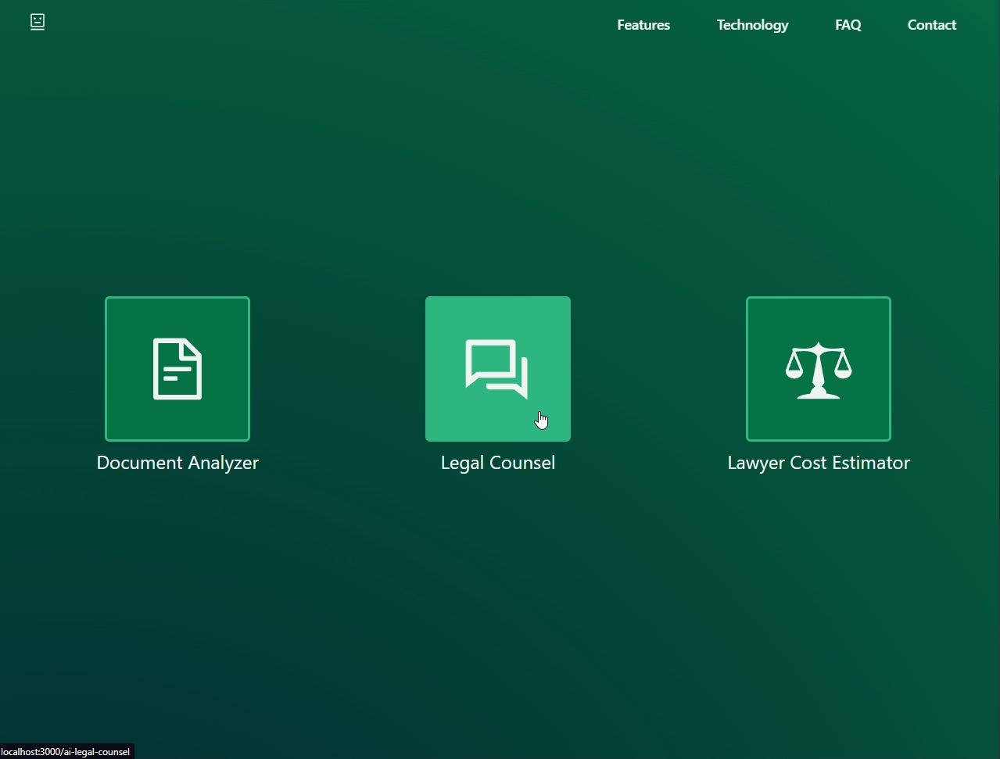
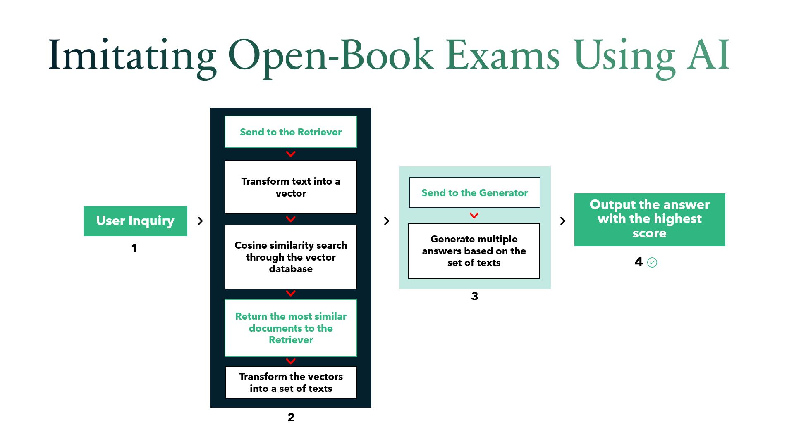
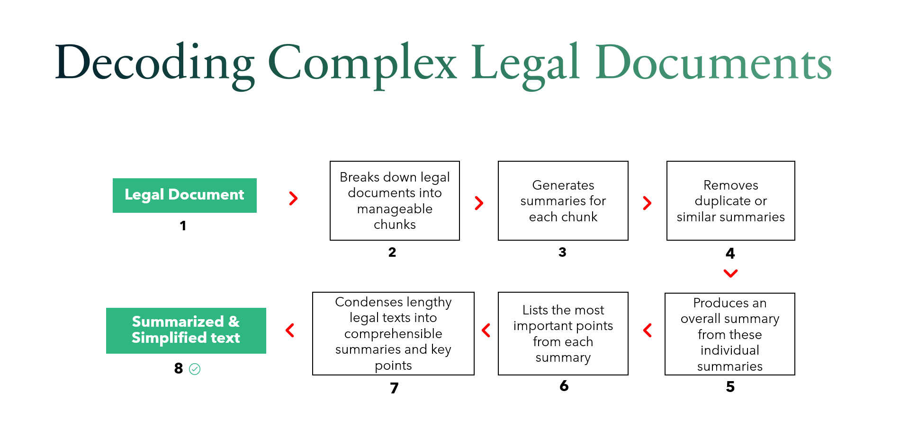
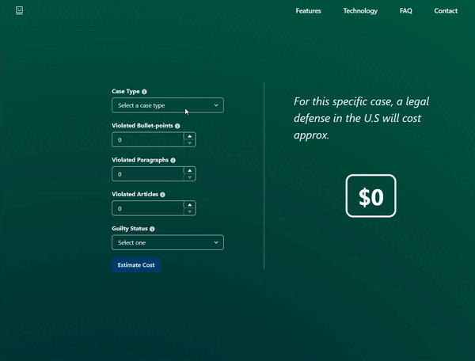

# LegalEase-AI

### LegalEaseAI is a web app that uses AI to make complex legal topics simpler by: 
- Analyzing & Simplifying large legal documents
- Offering legal advice through a specialized law chatbot
- Predicting potential lawyer expenses

#### The main goal of LegalEaseAI is to make legal information easier to access and understand for everyone!

 
 

## Legal Counsel

The Legal Counsel is a chatbot that simplifies interactions with legal subjects. 
Users can ask any question and get fast responses. 
It covers many US legal fields. Using NLP, a vector database, and two different language models, the chatbot acts like a legal counsel.

 

  

 

The chatbot operates like an open-book exam. 
It begins with a user query that is transformed into a vector by the Retriever. 
This vector undergoes a similarity search in the vector database. 
The top matches are converted back into text and sent to the Generator, which provides several answers. 
The highest scoring answer is selected and shown to the user, mimicking the open-book exam process using AI mimicking the open-book exam process.

 

 
 
 

## Document Analyzer

The Document Analyzer breaks down complex legal texts for easy understanding, Users will simply have to upload a contract in a PDF form 
and the tool auto-extracts and simplifies the content:
- Generates a concise summary
- Highlights crucial points
- Employs advanced NLP and two distinct LLMs

 

  

 

The Document Analyzer works by dividing a legal document into manageable paragraphs.
Each paragraph is then summarized, and duplicate summaries are removed. 
A single overview paragraph is created from these summaries, and the most important points are identified and listed out. 
This process simplifies large legal texts, creating brief summaries and key points, making it easier for users to understand their legal commitments.

 

 
 
 

## Lawyer Cost Estimator

The Lawyer Cost Estimator is a tool that uses machine learning to quickly estimate potential lawyer costs in the United States, 
based on specific case details:
- Utilizes a regression machine learning algorithm 
- Relies on a custom dataset
- Offers estimations based on the most recent prices

 

  

 
 
 
 

### *To sum it up, this project combines  AI technologies and techniques such as large-language-models (LLMs), natural language processing (NLP) methods and web tools like vectorized databases, ReactJS and Flask. It's a real example of how AI can make things better for everyone!*

